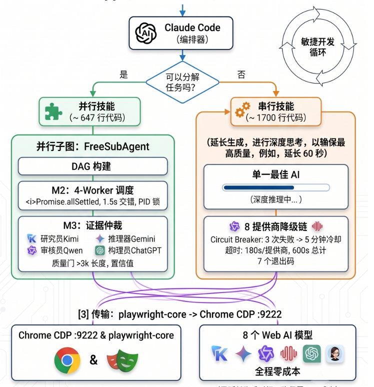

# AgentChat — Free Web-SubAgent Workflow

> Claude Code 接低价/免费API做决策分工，
> Gemini/ChatGPT/Claude 等免费网页 AI 执行子任务。

[](LICENSE)
[](https://nodejs.org/)
[](https://www.python.org/)
[](#-为什么用这个)
[](#-为什么用这个)
[](#-claude-code-integration)


## 什么是 Free Web-SubAgent ？

- 🎭一套零成本的 Claude Code 技能套件，通过接管本地 Chrome 浏览器桥接 8 个免费网页 AI
- 🛡支持串行降级（单模型自动切换）与并行编排（角色分工+证据仲裁)
- 💸免费额度用尽后自动切换到下一个免费模型

## 📂 Skills 概览

| Skill | 类型 | 职责 | 何时用 |
|-------|------|------|--------|
| **AgentChat-WebExtended** | 串行降级链 | 只使用一个你最喜欢的ai，免费额度耗尽自动切换，8-Provider 自动 fallback
| **AgentChat-FreeSubAgent** | 并行编排 | 适合大量独立性较高的任务，如16个独立任务让8个Web 端分别执行两个任务
| **Web-SubAgent-Workflow** | 串行管道 | 核心Skill（架构图如下），6 步 AI 管道：你的Agent规划→Kimi 搜索→Gemini 推理→Agent 合成→ChatGPT或Claude 审查 | 深度推理 + 质量审查 |

---

## 🏗️ Architecture



## 🚀 Quick Start（5 分钟）

### 1. 安装

```bash
git clone https://github.com/ziwang-Physics/AgentChat.git && cd AgentChat

# Python 依赖（Chrome daemon — 使用系统 Chrome，不需要 Playwright Chromium）
pip3 install playwright websocket-client

# Node.js 依赖（AI bridge — 根目录统一管理 + WebExtended skill）
npm install
(cd skills/AgentChat-WebExtended && npm install)
```

### 2. 配置 & 启动

```bash
cp .env.example .env           # 按需修改代理地址
bash scripts/setup.sh          # 环境检查
bash scripts/start-chrome-debug.sh  # 启动 Chrome daemon
```

### 3. 使用

```bash
# 单 prompt — 自动选择 provider（内置 fallback）
/AgentChat-WebExtended 什么是量子点（默认使用Gemini）

# 指定 provider
/AgentChat-WebExtended 使用Claude解释量子限域效应（可指定Ai）

# 4 路并发编排 — 任务自动拆解 + 证据仲裁
/AgentChat-FreeSubAgent 量子点做什么容易发Nature（Kimi查+Gemini推+Qwen核+ChatGPT写）

```

---

## 📂 Skills 概览

| Skill | 职责 | 何时用 |
|-------|------|--------|
| **AgentChat-WebExtended** | 8-Provider 降级链，自动切换、Quota 检测、遥测 | 单 prompt 需要高可用；批处理；不关心具体用哪个 AI |
| **AgentChat-FreeSubAgent** | 任务拆解 → 4 worker 并发 → 证据仲裁 | 复杂研究任务需要多角度互补分析 |

---

## 🧠 Claude Code Integration

本项目是 Claude Code 原生 skill 集合。每个 skill 目录包含：

| 文件 | 面向 | 职责 |
|------|------|------|
| `SKILL.md` | 🤖 **AI（Claude Code）** | 操作指南、触发条件、执行步骤 |
| `index.js` | ⚙️ **Runtime** | Playwright/CDP 实现 |
| `README.md`（本文件） | 👤 **人类开发者** | 项目介绍、安装、使用 |

> **SKILL.md ≠ README.md**：SKILL.md 是给 AI 读的 playbook，README.md 是给你读的文档。两者各司其职，内容不重复。
>
> 通过 symlink 将 `skills/` 目录链接到 `~/.claude/skills/`，Claude Code 即可自主调度这些免费资源。

---

## 📊 使用场景

### Claude Code 中（Slash Command）

```bash
# 单 prompt — 自动 fallback，第一个可用 provider 返回
/AgentChat-WebExtended 解释量子限域效应

# 指定 provider 起始
/AgentChat-WebExtended --from=ChatGPT 帮我写一段 Python 脚本

# 4 路并发 — 角色分工 + 证据仲裁
/AgentChat-FreeSubAgent 复杂问题拆分如：量子点理论计算方向做什么容易发文章
```

### 终端直接调用

```bash
# 🔬 学术研究 — 4 路并发
node skills/AgentChat-FreeSubAgent/index.js "量子点理论计算方向做什么最好发文章"

# 💻 代码审查 — 单路高可用，自动降级保证不挂
node skills/AgentChat-WebExtended/index.js "Review this diff for bugs and suggest improvements"

# 🩺 环境检查
node skills/AgentChat-WebExtended/index.js --smoke
```

---

## 📁 目录结构

```
AgentChat/
├── .env.example                         # 配置模板
├── .gitignore
├── LICENSE                              # MIT
├── package.json                         # 根依赖（playwright-core，共享 lib 使用）
├── README.md                            # 👤 人类文档
├── 1.png                                # 架构图
├── scripts/
│   ├── setup.sh / setup.bat             # 环境一键检查
│   ├── start-chrome-debug.sh            # Chrome CDP daemon（idempotent, Linux）
│   ├── start-chrome-debug.py            # Python daemon v3 — 事件驱动 Chrome 生命周期管理
│   ├── start-chrome.ps1                 # Windows PowerShell 启动
│   └── connect-gemini.sh / .ps1         # 一键连接 Gemini
└── skills/
    ├── lib/                               # 🔗 共享库（零代码重复的核心）
    │   ├── execute.js                     #   统一子进程执行器（callProvider / runChain）
    │   ├── providerFactory.js             #   10-step config-driven pipeline
    │   ├── errors.js                      #   ProviderError + 管道阶段追踪
    │   ├── cdp.js                         #   CDP 连接 + 重试 + doctor
    │   ├── terminal.js                    #   终端 spinner + 计时器
    │   ├── telemetry.js                   #   遥测日志轮转
    │   ├── locks.js                       #   文件锁（mkdir 原子性，provider 互斥）
    │   ├── geminiModelSwitch.js           #   Gemini Pro Extended / Flash 模型切换
    │   ├── prompts.js                     #   DAG 拆解 prompt 模板
    │   └── providers/
    │       ├── chain.js                   #   Provider 优先级链（单一真相源）
    │       └── adapters/                  #   8 个 provider config（"单源真相"）
    │           ├── gemini.js              #     Pro Extended + bursty 检测 + safety 过滤
    │           ├── chatgpt.js             #     3-tier 输入 + React send-btn 验证
    │           ├── claude.js              #     ProseMirror + Thinking 占位符过滤
    │           ├── qwen.js                #     React SPA + stop-btn detached
    │           ├── kimi.js                #     新建会话 + 自适应稳定性窗口
    │           ├── minimax.js             #     TipTap 异步挂载
    │           ├── mimo.js                #     DOM 遍历 send button
    │           └── deepseek.js            #     标准管线
    ├── AgentChat-WebExtended/           # 8-Provider Fallback Chain
    │   ├── SKILL.md                     # 🤖 AI 操作指南
    │   ├── index.js                     # 编排入口（~530 行，零 provider 代码）
    │   ├── CHANGELOG.md                 # 变更日志
    │   ├── package.json
    │   └── data/                        # 遥测数据
    ├── AgentChat-FreeSubAgent/          # 并行编排器（DAG + 波次调度 + 证据仲裁）
    │   ├── SKILL.md                     # 🤖 AI 操作指南 + 角色分工
    │   └── index.js                     # 薄编排器（~710 行，零 provider 代码）
    └── Web-SubAgent-Workflow/           # 串行 6 步管道
        ├── SKILL.md                     # 🤖 AI 操作指南
        └── index.js                     # 管道 helper（~160 行，零 provider 代码）
```

---

<details>
<summary>🔧 环境要求 & 配置详解</summary>

### 依赖

| 依赖 | 安装 |
|------|------|
| **Node.js 18+** | [nodejs.org](https://nodejs.org/) |
| Python 3.8+ | 系统自带 |
| Playwright (Python) | `pip3 install playwright`（daemon 用其 API 启动系统 Chrome） |
| websocket-client | `pip3 install websocket-client` |
| playwright-core (npm) | 根目录 `npm install`（共享 lib 依赖） |

### 配置变量（`.env`）

| 变量 | 默认值 | 说明 |
|------|--------|------|
| `CDP_PORT` | `9222` | Chrome DevTools Protocol 端口 |
| `PROXY_SERVER` | `http://127.0.0.1:7897` | 代理地址（中国大陆**必须**） |
| `CHROME_PROFILE` | `~/.chrome-debug-profile` | Chrome 持久化 Profile |
| `CHROMIUM_PATH` | 无（必须手动设置） | 系统 Chrome 可执行文件路径 |
| `LOG_FILE` | `/tmp/chrome-debug.log` | 诊断日志 |

### 🔐 AI 网页登录

首次使用前，在 Chrome 中手动登录以下 AI 网页（登录态保存在 `CHROME_PROFILE`，只需一次）：

| AI | 登录地址 | 账号类型 |
|----|---------|---------|
| Gemini | gemini.google.com/u/0/app | Google 账号（免登录仅 Flash 模型） |
| ChatGPT | chatgpt.com | OpenAI 账号 |
| Claude | claude.ai | Anthropic 账号 |
| Qwen | www.qianwen.com | 阿里云/淘宝 |
| Kimi | kimi.moonshot.cn | 微信/手机号 |
| MiniMax | agent.minimaxi.com | 手机号 |
| MiMo | aistudio.xiaomimimo.com | 小米账号 |
| DeepSeek | chat.deepseek.com | 微信/手机号 |

也可以将账号密码写入环境变量交给 Agent 自动登录（`.env.example`提供示例）。
</details>

<details>
<summary>🇨🇳 中国网络环境特别说明</summary>

GFW 会阻断 Chrome 启动时向 Google 云端发起的 SSL 请求，导致 Chrome 进入 **fail-safe 模式**（Gemini tab 显示 `about:blank`）。

**必须做的**：
- `.env` 中 `PROXY_SERVER` 配置正确的 HTTP/SOCKS5 代理
- **严禁使用 VLESS Reality** — TLS spoofing 与 Chrome BoringSSL 冲突

**如果仍然 `about:blank`**：
```bash
pkill -9 chrome && bash scripts/start-chrome-debug.sh
```

详见 `skills/AgentChat-WebExtended/SKILL.md` → 各 Provider 实现说明。
</details>

<details>
<summary>🛠️ 故障排查</summary>

| 症状 | 原因 | 修复 |
|------|------|------|
| Gemini tab `about:blank` | Chrome 3-layer fail-safe | `pkill -9 chrome && bash scripts/start-chrome-debug.sh` |
| `ERR_BLOCKED_BY_CLIENT` | Safe Browsing | 检查 flags 含 `--disable-features=OptimizationHints` |
| SSL `net_error -100` | GFW RST 或 Reality TLS 冲突 | 用 HTTP/SOCKS5 代理，不用 VLESS Reality |
| `MODULE_NOT_FOUND: playwright-core` | npm 依赖未安装 | 根目录 `npm install` |

### 手动管理

```bash
# 查看 daemon 状态
curl -s http://127.0.0.1:9222/json/list | python3 -c "
import json,sys
[print(f'{p[\"title\"]} | {p[\"url\"]}') for p in json.load(sys.stdin) if p.get('type')=='page']
"

# 查看日志
cat /tmp/chrome-debug.log

# 完全重启
pkill -9 -f "start-chrome-debug.py" && pkill -9 chrome
sleep 2 && bash scripts/start-chrome-debug.sh
```
</details>

---

## 🤝 Contributing

欢迎提 Issue 和 PR。新增 provider 请在 `lib/providers/adapters/` 中添加 adapter config（参考现有 8 个），编排层改动请保持 `FreeSubAgent` 的零 provider 代码原则。

---

## 📜 License

MIT © [ziwang-Physics](https://github.com/ziwang-Physics)
