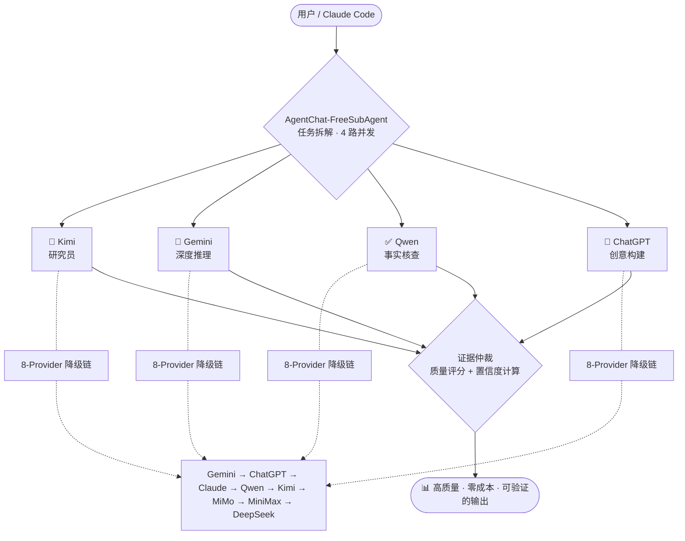

# AgentChat — Free Web-SubAgent Workflow

> Chrome CDP + Playwright 驱动的 Web AI 自动化交互系统

[](LICENSE)
[](https://nodejs.org/)
[](https://www.python.org/)
[](#-8-provider-fallback-chain)
[](#-why-agentchat)
[](#-claude-code-integration)

> **Claude Code 接低价/免费API做决策分工，Gemini/ChatGPT/Claude 等免费网页 AI 执行子任务。**


## 什么是 Free Web-SubAgent ？

- 一套零成本的 Claude Code 技能套件，通过接管本地 Chrome 浏览器桥接 8 个免费网页 AI
- 支持串行降级（单模型自动切换）与并行编排（4角色分工+证据仲裁
- 免费额度用尽后自动切换到下一个免费模型
- PID 锁防冲突——三层架构零代码冗余

• FreeSubAgent = 并行编排器：多角色分工（研究/推理/检索/创作）+ 证据仲裁，拒绝重复回答 🚛
-  并行模式：多个 AI 同时执行不同子任务

• WebExtended = 单一 AI 桥梁：8 提供商自动降级 + 熔断器，一个入口搞定所有模型 🔌
-  串行模式：只用你最喜欢的一个 AI

## 为什么用这个？

**AgentChat "免费大脑💡"模式**：用最便宜的模型做规划，用最强大的免费 Web 端做推理。

| 维度 | 传统 API 方案 | AgentChat |
|------|-------------|-----------|
| **推理成本** | $50-500+/月（输入+输出双向计费） | **$0**（网页版免费，仅规划消耗几十 token） |
| **多模型调用** | 需维护 N 个平台的 API Key | **免 Key**，基于 Web 登录态自动调用 |
| **高可用** | 单点依赖，API 挂则任务挂 | **8 节点自动降级**，一个不可用秒切下一个 |
| **并发能力** | 受 Rate Limit 限制 | **4 worker 真正并行**，各自跑不同 AI |

### 五大核心创新

1. 💸 **零 API 成本** — 桥接 8 个免费网页版 AI，生成的数万 token 思考过程不花一分钱
2. 🛡️ **8-Provider 智能降级** — `Gemini → ChatGPT → Claude → Qwen → Kimi → MiMo → MiniMax → DeepSeek`，Quota 耗尽/超时自动切换
3. 🎭 **AI 角色分工体系** — Kimi=研究员 · Gemini=深度推理 · Qwen=事实核查 · ChatGPT=创意构建，互补不重叠
4. ⚖️ **证据仲裁机制** — 多 worker 并发结果经过质量门 + 长度差异检测 + 置信度计算，不盲目合并
5. 🎯 **薄编排器架构** — `FreeSubAgent` 仅 ~350 行，零 provider 代码重复，所有 AI 调用委托给 `WebExtended`

---

## 🏗️ Architecture



**三层设计（零代码重复）**：

```
AgentChat-FreeSubAgent  (~350 行，编排层)
    │  child_process.spawn()
    ▼
AgentChat-WebExtended   (~1700 行，Provider 唯一实现)
    │  playwright-core → Chrome CDP :9222
    ▼
Chrome → Gemini / ChatGPT / Claude / Qwen / Kimi / MiniMax / DeepSeek
```

- **编排层**只负责拆任务、派发、仲裁，不含任何 provider 实现
- **Provider 层**是单源真相——新增一个 AI 只需改 `WebExtended`，`FreeSubAgent` 自动受益

---

## 🚀 Quick Start（5 分钟）

### 1. 安装

```bash
git clone https://github.com/ziwang-Physics/AgentChat.git && cd AgentChat

# Python 依赖（Chrome daemon）
pip3 install playwright websocket-client
python3 -m playwright install chromium

# Node.js 依赖（AI bridge）
(cd skills/gemini-web-extended-thinking && npm install)
(cd skills/AgentChat-WebExtended && npm install)
```

### 2. 配置 & 启动

```bash
cp .env.example .env           # 按需修改代理地址
bash scripts/setup.sh          # 环境检查
bash scripts/start-chrome-debug.sh  # 启动 Chrome daemon
```

### 3. 使用

```bash
# 单 prompt — 自动选择 provider（内置 fallback）
node skills/AgentChat-WebExtended/index.js "什么是量子点？"

# 指定 provider
node skills/AgentChat-WebExtended/index.js --from=Kimi "解释量子限域效应"

# 4 路并发编排 — 任务自动拆解 + 证据仲裁
node skills/AgentChat-FreeSubAgent/index.js --timeout=900 "对比分析 Pt、Pd、Ru 三种催化剂的 CO 氧化活性"

# Gemini Pro Extended Thinking
node skills/gemini-web-extended-thinking/index.js "深度分析以下反应路径..."
```

---

## 📂 Skills 概览

| Skill | 职责 | 何时用 |
|-------|------|--------|
| **AgentChat-WebExtended** | 8-Provider 降级链，自动切换、Quota 检测、遥测 | 单 prompt 需要高可用；批处理；不关心具体用哪个 AI |
| **AgentChat-FreeSubAgent** | 任务拆解 → 4 worker 并发 → 证据仲裁 | 复杂研究任务需要多角度互补分析 |
| **gemini-web-extended-thinking** | Gemini Pro Extended Thinking 激活 | 需要极致推理深度，数学/科学/逻辑推演 |

---

## 🧠 Claude Code Integration

本项目是 Claude Code 原生 skill 集合。每个 skill 目录包含：

| 文件 | 面向 | 职责 |
|------|------|------|
| `SKILL.md` | 🤖 **AI（Claude Code）** | 操作指南、触发条件、执行步骤 |
| `index.js` | ⚙️ **Runtime** | Playwright/CDP 实现 |
| `README.md`（本文件） | 👤 **人类开发者** | 项目介绍、安装、使用 |

> **SKILL.md ≠ README.md**：SKILL.md 是给 AI 读的 playbook，README.md 是给你读的文档。两者各司其职，内容不重复。
>
> 将 `skills/` 目录挂载到 Claude Code 工作区，AI 即可自主调度这些免费资源。

---

## 📊 使用场景

```bash
# 🔬 学术研究 — 4 路并发，Kimi 查文献 + Gemini 做推理 + Qwen 核实 + ChatGPT 综合
node skills/AgentChat-FreeSubAgent/index.js "量子点理论计算方向做什么最好发文章"

# 💻 代码审查 — 单路高可用，自动降级保证不挂
node skills/AgentChat-WebExtended/index.js "Review this diff for bugs and suggest improvements"

# 🧮 深度推理 — Gemini Extended Thinking，最长思考链
node skills/gemini-web-extended-thinking/index.js "从第一性原理推导以下反应机制"
```

---

## 📁 目录结构

```
AgentChat/
├── .env.example                         # 配置模板
├── README.md                            # 👤 人类文档（你正在看）
├── scripts/
│   ├── setup.sh                         # 环境检查
│   ├── start-chrome-debug.sh            # Chrome daemon（idempotent）
│   ├── start-chrome-debug.py            # Playwright daemon
│   └── connect-gemini.sh                # 一键连接 Gemini
└── skills/
    ├── AgentChat-WebExtended/           # 8-Provider Fallback Chain
    │   ├── SKILL.md                     # 🤖 AI 操作指南
    │   ├── index.js                     # ~1700 lines，完整实现
    │   └── package.json
    ├── AgentChat-FreeSubAgent/          # 并行编排器
    │   ├── SKILL.md                     # 🤖 AI 操作指南 + 角色分工
    │   └── index.js                     # ~350 lines，零 provider 代码
    └── gemini-web-extended-thinking/    # Gemini Pro Extended Thinking
        ├── SKILL.md                     # 🤖 AI 操作指南
        ├── index.js
        └── package.json
```

---

<details>
<summary>🔧 环境要求 & 配置详解</summary>

### 依赖

| 依赖 | 安装 |
|------|------|
| **Node.js 18+** | [nodejs.org](https://nodejs.org/) |
| Python 3.8+ | 系统自带 |
| Playwright (Python) | `pip3 install playwright` |
| Playwright Chromium | `python3 -m playwright install chromium` |
| websocket-client | `pip3 install websocket-client` |
| playwright-core (npm) | 各 skill 目录内 `npm install` |

### 配置变量（`.env`）

| 变量 | 默认值 | 说明 |
|------|--------|------|
| `CDP_PORT` | `9222` | Chrome DevTools Protocol 端口 |
| `PROXY_SERVER` | `http://127.0.0.1:7897` | 代理地址（中国大陆**必须**） |
| `CHROME_PROFILE` | `~/.chrome-debug-profile` | Chrome 持久化 Profile |
| `CHROMIUM_PATH` | 自动检测 | 手动指定 Chrome 路径 |
| `LOG_FILE` | `/tmp/chrome-debug.log` | 诊断日志 |

### 🔐 Google 登录

Gemini Pro Extended Thinking 需要 Google 登录。登录态保存在 `CHROME_PROFILE`，只需一次：

```bash
python3 -c "
import os
from playwright.sync_api import sync_playwright
with sync_playwright() as p:
    ctx = p.chromium.launch_persistent_context(
        user_data_dir=os.path.expanduser(os.environ.get('CHROME_PROFILE', '~/.chrome-debug-profile')),
        headless=False,
        proxy={'server': os.environ.get('PROXY_SERVER', 'http://127.0.0.1:7897')},
        args=['--no-sandbox','--disable-gpu']
    )
    ctx.pages[0].goto('https://gemini.google.com/u/0/app')
    input('登录完成后按 Enter 关闭...')
    ctx.close()
"
```
</details>

<details>
<summary>🇨🇳 中国网络环境特别说明</summary>

GFW 会阻断 Chrome 启动时向 Google 云端发起的 SSL 请求，导致 Chrome 进入 **fail-safe 模式**（Gemini tab 显示 `about:blank`）。

**必须做的**：
- `.env` 中 `PROXY_SERVER` 配置正确的 HTTP/SOCKS5 代理
- **严禁使用 VLESS Reality** — TLS spoofing 与 Chrome BoringSSL 冲突

**如果仍然 `about:blank`**：
```bash
pkill -9 chrome && bash scripts/start-chrome-debug.sh
```

详见 `skills/gemini-web-extended-thinking/SKILL.md` → "Chrome 启动架构"章节。
</details>

<details>
<summary>🛠️ 故障排查</summary>

| 症状 | 原因 | 修复 |
|------|------|------|
| Gemini tab `about:blank` | Chrome 3-layer fail-safe | `pkill -9 chrome && bash scripts/start-chrome-debug.sh` |
| `ERR_BLOCKED_BY_CLIENT` | Safe Browsing | 检查 flags 含 `--disable-features=OptimizationHints` |
| SSL `net_error -100` | GFW RST 或 Reality TLS 冲突 | 用 HTTP/SOCKS5 代理，不用 VLESS Reality |
| `MODULE_NOT_FOUND: playwright-core` | npm 依赖未安装 | `cd skills/... && npm install` |

### 手动管理

```bash
# 查看 daemon 状态
curl -s http://127.0.0.1:9222/json/list | python3 -c "
import json,sys
[print(f'{p[\"title\"]} | {p[\"url\"]}') for p in json.load(sys.stdin) if p.get('type')=='page']
"

# 查看日志
cat /tmp/chrome-debug.log

# 完全重启
pkill -9 -f "start-chrome-debug.py" && pkill -9 chrome
sleep 2 && bash scripts/start-chrome-debug.sh
```
</details>

---

## 🤝 Contributing

欢迎提 Issue 和 PR。新增 provider 请在 `AgentChat-WebExtended` 中添加，编排层改动请保持 `FreeSubAgent` 的零 provider 代码原则。

---

## 📜 License

MIT © [ziwang-Physics](https://github.com/ziwang-Physics)
